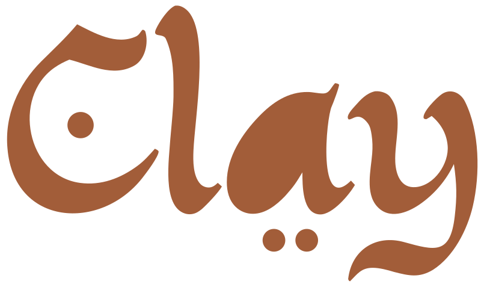

<p align="center">
  
</p>

<h1 align="center">Clay · כלי</h1>

<p align="center"><em>Sacred in the everyday.</em></p>

<p align="center">
Israeli pottery studio making traditional and contemporary ceramics.<br>
The name is a bilingual pun: "Clay" (the material) / "כלי" (kli — vessel) / "כלי קודש" (klei kodesh — holy vessels).
</p>

---

## Brand at a Glance

**Personality:** Warm · Sincere · Down-to-earth

### Colors

<table>
  <tr>
    <td align="center"><br><code>#A25D39</code><br>Terracotta</td>
    <td align="center"><br><code>#813F25</code><br>Dark</td>
    <td align="center"><br><code>#B6704E</code><br>Light</td>
    <td align="center"><br><code>#C4926F</code><br>Muted</td>
  </tr>
  <tr>
    <td align="center"><br><code>#F2EFE4</code><br>Cream</td>
    <td align="center"><br><code>#EDE8D8</code><br>Warm</td>
    <td align="center"><br><code>#4A6B7A</code><br>Glaze</td>
    <td align="center"><br><code>#6B8D9C</code><br>Glaze Light</td>
  </tr>
</table>

### Typography

- **Display:** [Cormorant](https://fonts.google.com/specimen/Cormorant) — Light 300, Regular 400, Italic
- **Body:** [DM Sans](https://fonts.google.com/specimen/DM+Sans) — Light 300, Regular 400, Medium 500
- **Scale:** Perfect Fourth (1.333)

### Logo

<table>
  <tr>
    <td align="center" style="background:#F2EFE4;padding:2rem"></td>
    <td align="center" bgcolor="#37322B" style="padding:2rem"></td>
  </tr>
  <tr>
    <td align="center"><em>SVG — transparent bg</em></td>
    <td align="center"><em>Original source</em></td>
  </tr>
</table>

Hebrew-influenced calligraphic wordmark. The angular strokes reference Hebrew script — the bilingual meaning lives in the letterforms themselves.

- **Primary use:** terracotta on cream
- **Reversed:** cream on terracotta or dark backgrounds
- **Minimum size:** 32px width (signature dots become illegible below this)
- **Counter fill:** the 'a' counter must match the background color

### Voice

Warm but direct. Speaks from the workshop, not the gallery.

| This | Not that |
|------|----------|
| "Handmade in Israel" | "Artisanally crafted ceramic experiences" |
| "For your table" | "Elevate your dining aesthetic" |
| "Each piece is different" | "Every creation is a unique masterpiece" |
| "Come find us at the market" | "Visit our exclusive pop-up showcase" |

---

## Files

```
clay/
├── brand-guide.md           ← full brand guide with usage rules
├── design-tokens.css        ← CSS custom properties (colors, type, spacing)
├── assets/
│   ├── clay-logo.svg        ← primary logo — transparent background
│   └── clay-logo-vectorized.svg  ← Recraft vectorization with background
└── mockups/
    └── brand-system.html    ← visual brand system (open in browser)
```

## Quick Start

1. Open `clay/mockups/brand-system.html` in a browser to see the full visual system
2. Reference `clay/design-tokens.css` for all color, type, and spacing values
3. Read `clay/brand-guide.md` for usage rules, voice guidelines, and application notes
